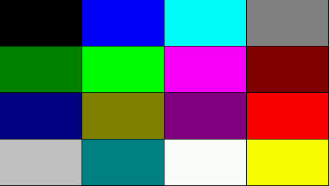

# Color test

*Displays all MicroUI basic colors in order to test if the display driver is working properly.*

It has two modes:
1. *Static mode*: All the 16 colors are laid out in a 4x4 grid in the same order as the screenshot.
2. *Permuted mode*: All the 16 colors are laid out as in *Static mode*, but the columns shift to the right. The rows remain untouched. This can be useful to test the refresh rate.

To switch between modes, toggle the boolean at the following line in `Main.java`:
```java
private static final boolean PERMUTE_COLORS = false;
```

To adjust the timing of the permuted mode, change the following line in `PermutedBasicColorsPage.java`:
```java
private static final int UPDATE_DELAY_MS = 1000;
```

## Screenshot
Can be used as a color reference when comparing the actual output on the device.


